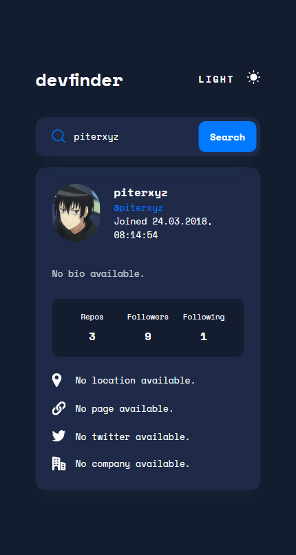
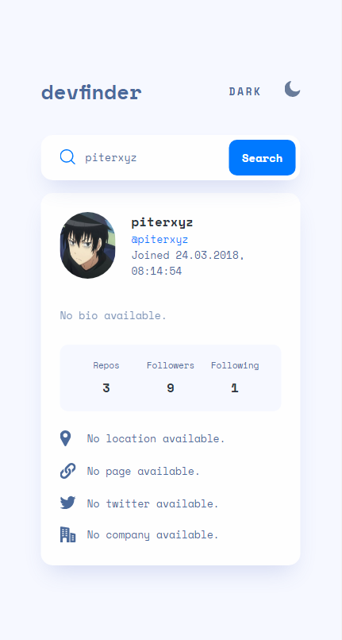

# 👾 GitHub User Search
Search information about GitHub users by name.

  

## Features
- [x] Search for GitHub users by name with [GitHub API](https://docs.github.com/en/rest)
- [x] Dark and light theme support
- [x] Mobile support

## Built with
- HTML
- SCSS
- JavaScript
